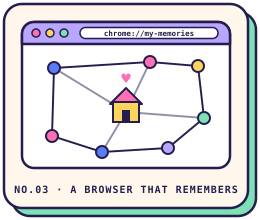
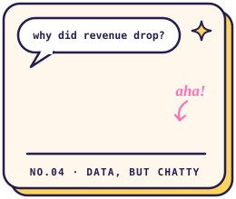
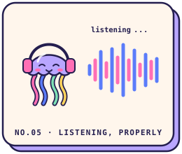

  

  

## ✿ hello, hello

<table>
<tr>
<td width="60%" valign="top">

I build things I find interesting — and I find a *lot* of things interesting.

Sometimes that's an **AI agent making safety calls** on a factory floor. Sometimes it's a **coding agent that remembers why**. Sometimes it's a **browser that quietly takes notes**, a **map with far too many layers**, or a SpeechLLM that absolutely refuses to understand an accent (we're working on it).

I like living underneath the interface: agents, retrieval, event-driven backends, local inference, and the plumbing that keeps it all from falling over.

I learn best by building, breaking, and rebuilding.

</td>
<td width="40%" valign="top">

**field notes**

| | |
|:--:|:--|
| 🔬 | researching at **Samsung PRISM** |
| 🏆 | **4×** hackathon winner |
| 🎓 | Comp. Eng. @ Thapar · **8.78** |
| 📍 | Patiala, India |
| ☕ | runs on curiosity & caffeine |
| 🐛 | debugging ratio: *questionable* |

</td>
</tr>
</table>

## ✦ the specimen cabinet

things i've built, pinned and labelled for your viewing pleasure.

<table>
<tr>
<td width="240" valign="top" align="center"></td>
<td valign="top">

### SOP Opera
*agentic industrial safety intelligence*

 

A multi-agent system that catches **compound** risk before high-risk work gets approved. A gas reading, a work permit, an isolation state, a worker's location — each looks fine alone. The danger lives in the combination, so the system reasons over all of it at once.

- false negatives **44.5% → 0%** across 593 labelled cases; hazards caught **28 min** earlier
- LangGraph pipeline with conditional agent fan-out
- hybrid pgvector + SQL retrieval over clause-level regulations, so every call cites its rule
- durable Postgres job queue, WebSockets with per-client backpressure, hash-chained audit trail

`Python` `TypeScript` `FastAPI` `LangGraph` `PostgreSQL` `pgvector` `Next.js` `Docker`

</td>
</tr>
</table>

<table>
<tr>
<td width="240" valign="top" align="center"></td>
<td valign="top">

### FlowSync
*persistent memory for coding agents*

Coding agents can write code. They're terrible at remembering *why* it exists. FlowSync collects the whys — decisions, risks, and tasks pulled straight out of git diffs — and keeps them in a jar your agent can reach into.

- event-driven extraction from git diffs via Bedrock
- VS Code extension + MCP server for logging, project search, and retrieval
- branch-aware RAG with DynamoDB caching — **1.26s** median push → search (p95 1.60s)

`TypeScript` `Python` `AWS Bedrock` `Lambda` `DynamoDB` `S3` `MCP` `Next.js`

</td>
</tr>
</table>

<table>
<tr>
<td width="240" valign="top" align="center"></td>
<td valign="top">

### Konta
*your browser remembers — locally*

A local-first Chrome extension that turns browsing into a private little constellation of everything you've read. The embeddings never leave home — no giant cloud brain required.

- on-device semantic embeddings with Transformers.js + ONNX
- knowledge graph linking pages by meaning, time, and context
- session boundary detection, so unrelated rabbit holes stay separate

`TypeScript` `React` `IndexedDB` `Transformers.js` `ONNX`

</td>
</tr>
</table>

<table>
<tr>
<td width="240" valign="top" align="center"></td>
<td valign="top">

### GINA
*ask questions, get grounded data*

Ask *"why did revenue drop?"* in plain words and get back validated SQL, real numbers, and an answer streamed as it's found.

- multi-model NL → SQL pipeline with structured, grounded query generation
- SSE streaming with fast-path routing over snapshots and cache restoration
- multi-turn memory and schema self-correction loops

`Next.js` `TypeScript` `Fastify` `PostgreSQL` `Supabase` `SSE`

</td>
</tr>
</table>

## ☾ research corner

<table>
<tr>
<td width="240" valign="top" align="center"></td>
<td valign="top">

### Accent-Invariant Representation Learning for SpeechLLMs
*Samsung PRISM · ongoing*

How do you teach a speech model to understand accented English **without** retraining the whole thing?

- parameter-efficient adaptation: LoRA adapters, MoE dynamic adapter routing, accent-aware encoders
- benchmarking SALM, Qwen Audio, and SALMONN
- speaker- and accent-level failure analysis to find where models stumble
- headed for a peer-reviewed publication

`PyTorch` `SALM` `Qwen Audio` `SALMONN` `LoRA / PEFT`

> *make speech models listen to the speaker, not the accent.*

</td>
</tr>
</table>

## ★ trophy shelf

| | | |
|:--:|:--|:--|
|  | **Economic Times AI Hackathon 2.0** | 60,000+ participants · 10,000+ teams · 28 finalists |
|  | **NioHack 2026** · Niograph Inc., USA | innovate · build · transform |
|  | **Samsung PRISM Web Agent Hackathon** | 450+ participants · 120+ teams |
|  | **Agentic AI Hackathon 2025** · Ulster University, UK | 150+ teams |

## ✎ where i've been

<table>
<tr>
<td width="50%" valign="top">

### Samsung PRISM
`research intern` · **Sept 2026 — now** · remote

SpeechLLMs, accented speech, and parameter-efficient adaptation. Benchmarks, failure analysis, adapter routing — aimed at publication.

</td>
<td width="50%" valign="top">

### BharatRohan
`software developer intern` · **Jul — Aug 2026** · remote

Production geospatial features in React + OpenLayers: vector and raster layers, projections, coordinate systems, and maps with far too many layers.

</td>
</tr>
</table>

## ⚗ the spellbook

**languages** 
   

**build** 
     

**think** 
      

**store** 
     

**ship** 
    

## ◔ github, but make it statistics

  

 

made with curiosity, caffeine, and questionable amounts of debugging.

