<div align="center">



<br>

<a href="https://www.ikyano.tech/"></a>
<a href="https://www.linkedin.com/in/anoushka-awasthi-a87754247/"></a>
<a href="https://github.com/anoushkawasthi"></a>
<a href="mailto:awasthinush2580@gmail.com"></a>

<br><br>


<br>


</div>

## `01` &nbsp;about

<table>
<tr>
<td width="62%" valign="top">

I build systems that have to **reason**, not just respond.

Most of my work lives one layer below the interface — multi-agent orchestration, retrieval that actually retrieves, event-driven backends, on-device inference, and the unglamorous plumbing that keeps all of it standing up: durable job queues, backpressure, caching, tamper-evident audit trails.

The interesting problems are rarely "can the model answer this." They're *can the system hold the whole situation in its head at once* — and can you prove afterwards why it decided what it decided.

Right now I'm researching **accent-invariant representation learning for SpeechLLMs** at Samsung PRISM, and building tools that remember.

</td>
<td width="38%" valign="top">

**currently**

`🜂` researching SpeechLLM accent adaptation @ **Samsung PRISM**

`🜁` building memory layers for coding agents

`🜃` 4× hackathon winner — incl. **1st / 60,000+**

<br>

**at a glance**

| | |
|:--|:--|
| 📍 | Patiala, India |
| 🎓 | B.E. Computer Engineering, Thapar |
| 📊 | CGPA **8.78** |
| 🌐 | [ikyano.tech](https://www.ikyano.tech/) |

</td>
</tr>
</table>


## `02` &nbsp;impact

<div align="center">

</div>


## `03` &nbsp;selected work

<table>
<tr><td>

### 🜂 &nbsp;SOP Opera
**agentic industrial safety intelligence**

  

A multi-agent system that catches **compound** operational risk before high-risk work gets approved. The hard part was never getting an LLM to answer questions — it was getting the system to reason over the whole situation at once: gas readings, work permits, isolation state, and worker location, *together*. Any one of those looks fine in isolation. The danger lives in the combination.

- **Compound risk engine** fusing four independent operational signals — catches hazards that single-sensor thresholds structurally cannot see
- **LangGraph pipeline** with conditional agent fan-out, so the orchestration shape adapts to the situation instead of running a fixed chain
- **Hybrid pgvector + SQL retrieval** over a clause-level regulatory corpus — every decision cites the clause it rests on
- **Durable PostgreSQL job queue** and a non-blocking WebSocket layer with per-client backpressure
- **Hash-chained audit trail** — tamper-evident record of every safety decision made

<sub>`Python` · `TypeScript` · `FastAPI` · `LangGraph` · `PostgreSQL` · `pgvector` · `Next.js` · `Docker`</sub>

<a href="https://github.com/anoushkawasthi"></a>

</td></tr>
</table>

<table>
<tr><td>

### 🜁 &nbsp;FlowSync
**persistent memory for coding agents**

Coding agents can write code. They're not good at remembering *why* that code exists. FlowSync turns raw project activity into searchable, branch-aware institutional memory — so the agent arrives already knowing the decisions, the risks, and what got ruled out.

```
git diff ──▶ Bedrock ──▶ decisions · risks · tasks ──▶ branch-aware retrieval ──▶ your agent
```

- **Event-driven extraction** pulling structured decisions, risks, and tasks straight out of git diffs
- **VS Code extension + MCP server** for context logging, project search, and retrieval inside the editor
- **Branch-aware RAG** with DynamoDB caching — **1.26s median** push-to-search, p95 1.60s

<sub>`TypeScript` · `Python` · `AWS Bedrock` · `Lambda` · `DynamoDB` · `S3` · `MCP` · `Next.js`</sub>

<a href="https://github.com/anoushkawasthi"></a>

</td></tr>
</table>

<table>
<tr><td>

### 🜃 &nbsp;Konta
**your browser remembers — locally**

 

A local-first Chrome extension that turns browsing activity into a private knowledge layer. The embeddings never leave the device — no giant cloud brain required, and nothing to trust anyone with.

- **On-device semantic embeddings** via Transformers.js + ONNX, running entirely in the browser
- **Knowledge graph** linking pages across semantic, temporal, and contextual relationships
- **Sessionization with context-boundary detection**, so unrelated tasks stop bleeding into each other

<sub>`TypeScript` · `React` · `IndexedDB` · `Transformers.js` · `ONNX`</sub>

<a href="https://github.com/anoushkawasthi"></a>

</td></tr>
</table>

<table>
<tr><td>

### 🜄 &nbsp;GINA
**ask questions, get grounded data**

Conversational analytics that turns natural language into *validated* SQL and streams the answer back — with the schema correcting itself when the question and the database disagree.

```
"why did revenue drop?" ──▶ retrieval ──▶ SQL generation ──▶ validation ──▶ PostgreSQL ──▶ streamed insight
```

- **Multi-model NL→SQL pipeline** with structured outputs and grounded query generation
- **SSE streaming** with fast-path routing over snapshots and cache restoration
- **Multi-turn conversation state**, semantic schema correction loops, failure-tolerant SSE error handling

<sub>`Next.js` · `TypeScript` · `Fastify` · `PostgreSQL` · `Supabase` · `SSE`</sub>

<a href="https://github.com/anoushkawasthi"></a>

</td></tr>
</table>


## `04` &nbsp;research

<table>
<tr><td>

### Accent-Invariant Representation Learning for SpeechLLMs
**Samsung PRISM** · *ongoing*

> How do you make a SpeechLLM robust to accented English **without** retraining the whole model?

- **Parameter-efficient adaptation** — LoRA adapters, MoE dynamic adapter routing, accent-aware front-end encoders
- **Benchmarking** SALM, Qwen Audio, SALMONN across ASR/AST tasks
- **Failure analysis** at speaker level *and* accent level, to find which accents are actually worth adapting to
- Targeting a **peer-reviewed publication** as the closure deliverable

<sub>`PyTorch` · `SALM` · `Qwen Audio` · `SALMONN` · `LoRA / PEFT`</sub>

**the goal — make speech models listen to the speaker, not the accent.**

</td></tr>
</table>


## `05` &nbsp;trophy shelf

<div align="center">

| | | |
|:--|:--|:--|
|  | **Economic Times AI Hackathon 2.0** | 60,000+ participants · 10,000+ teams · 28 finalists |
|  | **NioHack 2026** — Niograph Inc., USA | Innovate · Build · Transform |
|  | **Samsung PRISM Web Agent Hackathon** | 450+ participants · 120+ teams |
|  | **Agentic AI Hackathon 2025** — Ulster University, UK | 150+ teams |

</div>


## `06` &nbsp;outside the terminal

<table>
<tr>
<td width="50%" valign="top">

### Samsung PRISM
`Research Intern` · **Sept 2026 — Present** · Remote

SpeechLLMs, accented speech, and parameter-efficient adaptation. Benchmarking, failure analysis, and adapter routing — aimed at publication.

</td>
<td width="50%" valign="top">

### BharatRohan
`Software Developer Intern` · **Jul — Aug 2026** · Remote

Production geospatial features in React + OpenLayers — vector and raster layers, projections, coordinate reference systems, map interactions, spatial visualization.

</td>
</tr>
</table>


## `07` &nbsp;the spellbook

<div align="center">

<br>

**languages**

   

**build**

     

**think**

      

**store**

     

**deploy**

    

<br>

</div>


## `08` &nbsp;github, but make it statistics

<div align="center">


<br><br>


</div>

<br>

<div align="center">



<br>

<a href="https://www.ikyano.tech/"></a>

<br><br>


</div>
